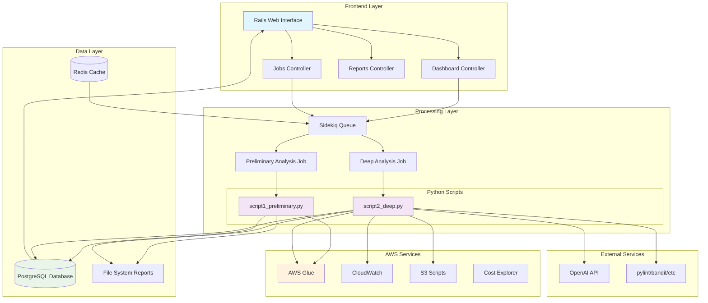
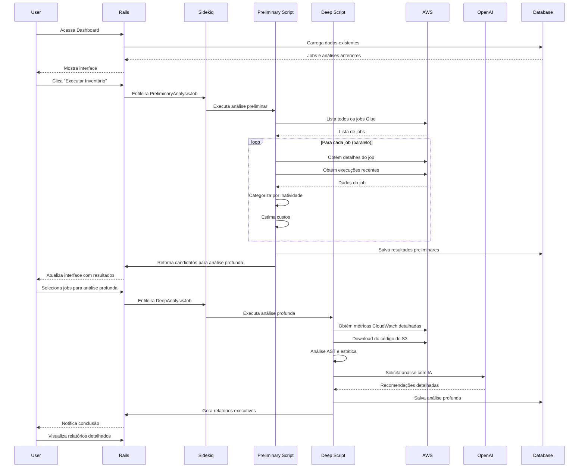
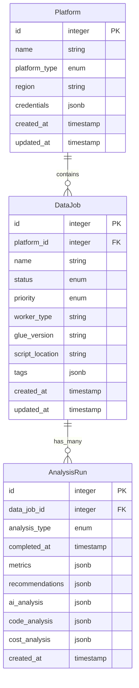
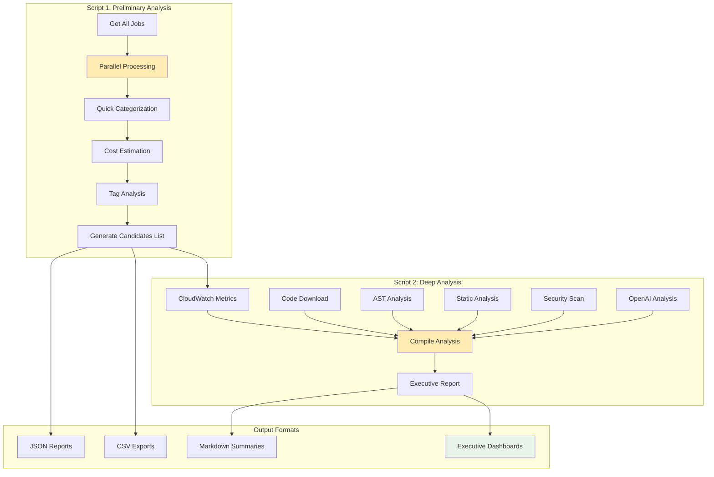
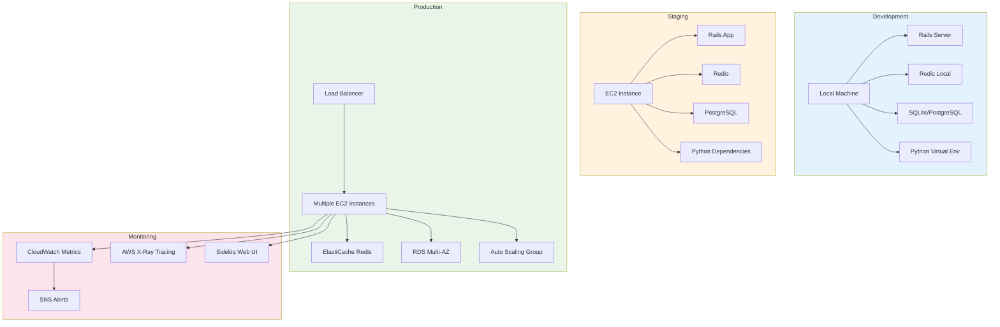

# Inventory
### Arquitetura

```mermaid
graph TB
    subgraph "Frontend Layer"
        UI[Rails Web Interface]
        Dashboard[Dashboard Controller]
        JobsController[Jobs Controller]
        ReportsController[Reports Controller]
    end
    
    subgraph "Processing Layer"
        Queue[Sidekiq Queue]
        PrelimJob[Preliminary Analysis Job]
        DeepJob[Deep Analysis Job]
        
        subgraph "Python Scripts"
            Script1[script1_preliminary.py]
            Script2[script2_deep.py]
        end
    end
    
    subgraph "Data Layer"
        PostgreSQL[(PostgreSQL Database)]
        Redis[(Redis Cache)]
        FileSystem[File System Reports]
    end
    
    subgraph "AWS Services"
        Glue[AWS Glue]
        CloudWatch[CloudWatch]
        S3[S3 Scripts]
        CostExplorer[Cost Explorer]
    end
    
    subgraph "External Services"
        OpenAI[OpenAI API]
        StaticTools[pylint/bandit/etc]
    end
    
    %% Connections
    UI --> Dashboard
    UI --> JobsController
    UI --> ReportsController
    
    Dashboard --> Queue
    JobsController --> Queue
    
    Queue --> PrelimJob
    Queue --> DeepJob
    
    PrelimJob --> Script1
    DeepJob --> Script2
    
    Script1 --> Glue
    Script1 --> PostgreSQL
    Script1 --> FileSystem
    
    Script2 --> Glue
    Script2 --> CloudWatch
    Script2 --> S3
    Script2 --> OpenAI
    Script2 --> StaticTools
    Script2 --> PostgreSQL
    Script2 --> FileSystem
    
    PostgreSQL --> UI
    Redis --> Queue
    
    style UI fill:#e1f5fe
    style Script1 fill:#f3e5f5
    style Script2 fill:#f3e5f5
    style PostgreSQL fill:#e8f5e8
    style Glue fill:#fff3e0
```

### Fluxo de execução

```mermaid
sequenceDiagram
    participant User
    participant Rails
    participant Sidekiq
    participant Script1 as Preliminary Script
    participant Script2 as Deep Script
    participant AWS
    participant OpenAI
    participant DB as Database
    
    User->>Rails: Acessa Dashboard
    Rails->>DB: Carrega dados existentes
    DB-->>Rails: Jobs e análises anteriores
    Rails-->>User: Mostra interface
    
    User->>Rails: Clica "Executar Inventário"
    Rails->>Sidekiq: Enfileira PreliminaryAnalysisJob
    Sidekiq->>Script1: Executa análise preliminar
    
    Script1->>AWS: Lista todos os jobs Glue
    AWS-->>Script1: Lista de jobs
    
    loop Para cada job (paralelo)
        Script1->>AWS: Obtém detalhes do job
        Script1->>AWS: Obtém execuções recentes
        AWS-->>Script1: Dados do job
        Script1->>Script1: Categoriza por inatividade
        Script1->>Script1: Estima custos
    end
    
    Script1->>DB: Salva resultados preliminares
    Script1->>Rails: Retorna candidatos para análise profunda
    Rails-->>User: Atualiza interface com resultados
    
    User->>Rails: Seleciona jobs para análise profunda
    Rails->>Sidekiq: Enfileira DeepAnalysisJob
    Sidekiq->>Script2: Executa análise profunda
    
    Script2->>AWS: Obtém métricas CloudWatch detalhadas
    Script2->>AWS: Download do código do S3
    Script2->>Script2: Análise AST e estática
    Script2->>OpenAI: Solicita análise com IA
    OpenAI-->>Script2: Recomendações detalhadas
    
    Script2->>DB: Salva análise profunda
    Script2->>Rails: Gera relatórios executivos
    Rails-->>User: Notifica conclusão
    
    User->>Rails: Visualiza relatórios detalhados
```

### Arquitetura de Dados

```mermaid
erDiagram
    Platform {
        id integer PK
        name string
        platform_type enum
        region string
        credentials jsonb
        created_at timestamp
        updated_at timestamp
    }
    
    DataJob {
        id integer PK
        platform_id integer FK
        name string
        status enum
        priority enum
        worker_type string
        glue_version string
        script_location string
        tags jsonb
        created_at timestamp
        updated_at timestamp
    }
    
    AnalysisRun {
        id integer PK
        data_job_id integer FK
        analysis_type enum
        completed_at timestamp
        metrics jsonb
        recommendations jsonb
        ai_analysis jsonb
        code_analysis jsonb
        cost_analysis jsonb
        created_at timestamp
    }
    
    Platform ||--o{ DataJob : contains
    DataJob ||--o{ AnalysisRun : has_many
```

### Componentes de processamento

```mermaid
flowchart TD
    subgraph "Script 1: Preliminary Analysis"
        A1[Get All Jobs] --> A2[Parallel Processing]
        A2 --> A3[Quick Categorization]
        A3 --> A4[Cost Estimation]
        A4 --> A5[Tag Analysis]
        A5 --> A6[Generate Candidates List]
    end
    
    subgraph "Script 2: Deep Analysis"
        B1[CloudWatch Metrics] --> B7[Compile Analysis]
        B2[Code Download] --> B7
        B3[AST Analysis] --> B7
        B4[Static Analysis] --> B7
        B5[Security Scan] --> B7
        B6[OpenAI Analysis] --> B7
        B7 --> B8[Executive Report]
    end
    
    A6 --> B1
    
    subgraph "Output Formats"
        C1[JSON Reports]
        C2[CSV Exports]
        C3[Markdown Summaries]
        C4[Executive Dashboards]
    end
    
    A6 --> C1
    A6 --> C2
    B8 --> C3
    B8 --> C4
    
    style A2 fill:#ffecb3
    style B7 fill:#ffecb3
    style C4 fill:#e8f5e8
```
# Deploy e Infraestrutura

```mermaid
graph TB
    subgraph "Development"
        Dev[Local Machine]
        DevRails[Rails Server]
        DevRedis[Redis Local]
        DevDB[SQLite/PostgreSQL]
        DevPython[Python Virtual Env]
        
        Dev --> DevRails
        Dev --> DevRedis
        Dev --> DevDB
        Dev --> DevPython
    end
    
    subgraph "Staging"
        Stage[EC2 Instance]
        StageRails[Rails App]
        StageRedis[Redis]
        StageDB[PostgreSQL]
        StagePython[Python Dependencies]
        
        Stage --> StageRails
        Stage --> StageRedis
        Stage --> StageDB
        Stage --> StagePython
    end
    
    subgraph "Production"
        Prod[Load Balancer]
        ProdEC2[Multiple EC2 Instances]
        ProdCache[ElastiCache Redis]
        ProdDB[RDS Multi-AZ]
        ProdAS[Auto Scaling Group]
        
        Prod --> ProdEC2
        ProdEC2 --> ProdCache
        ProdEC2 --> ProdDB
        ProdEC2 --> ProdAS
    end
    
    subgraph "Monitoring"
        CW[CloudWatch Metrics]
        XRay[AWS X-Ray Tracing]
        SidekiqUI[Sidekiq Web UI]
        SNS[SNS Alerts]
        
        ProdEC2 --> CW
        ProdEC2 --> XRay
        ProdEC2 --> SidekiqUI
        CW --> SNS
    end
    
    style Development fill:#e3f2fd
    style Staging fill:#fff3e0
    style Production fill:#e8f5e8
    style Monitoring fill:#fce4ec
```